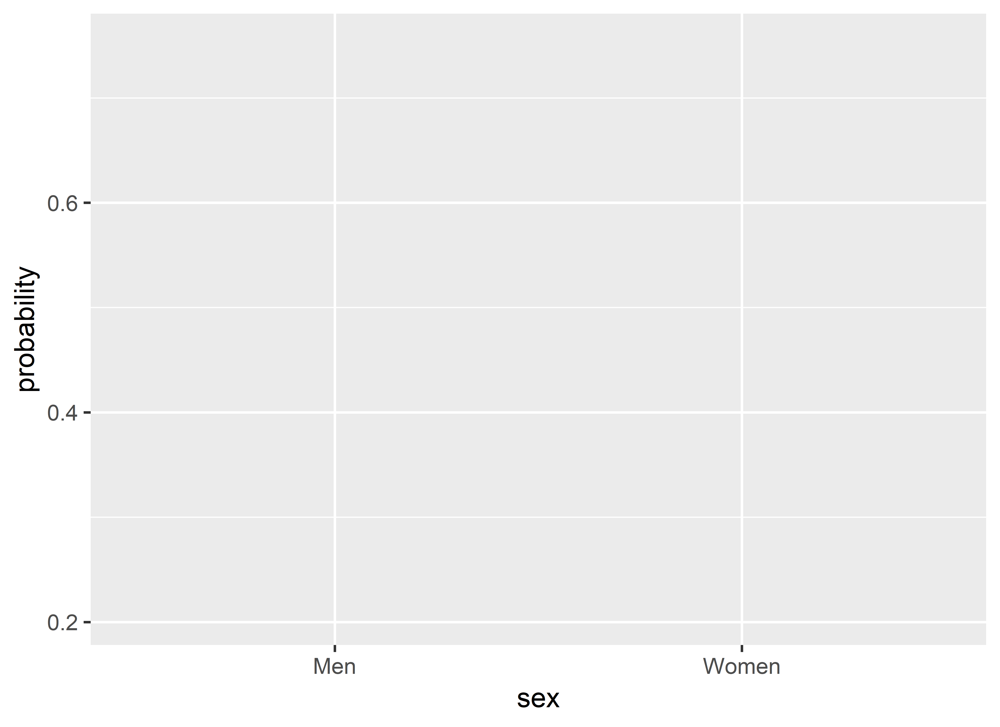
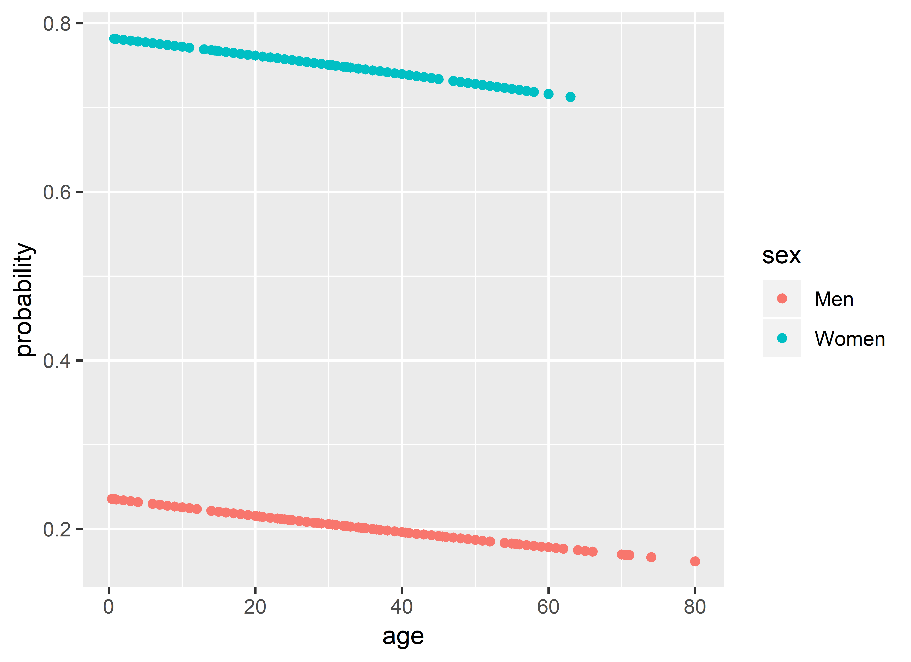
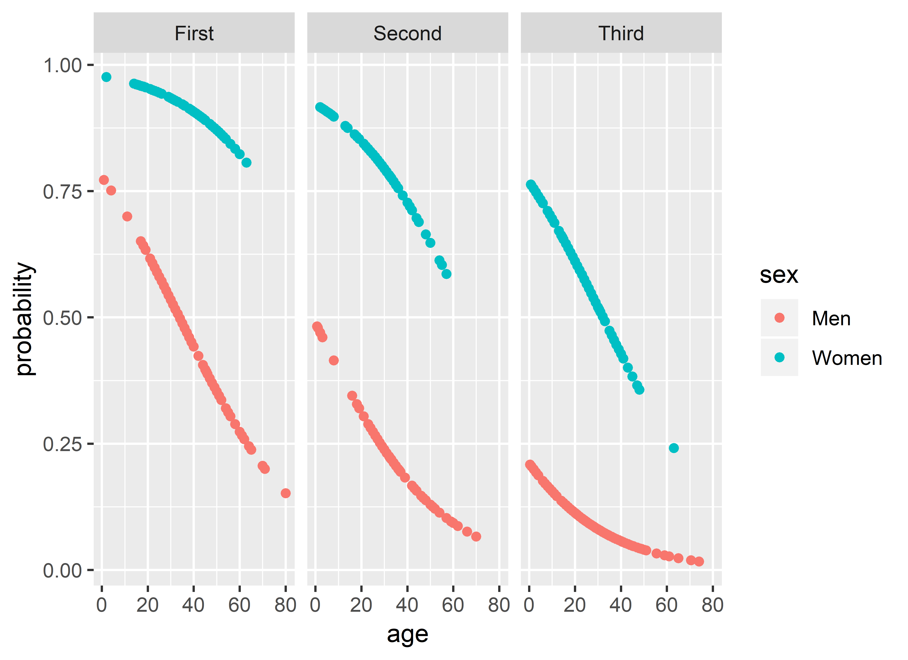
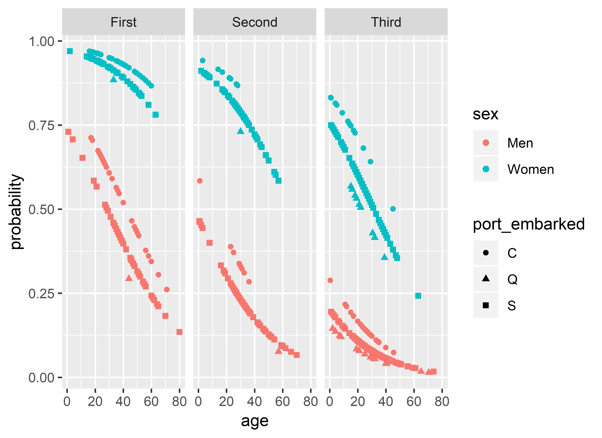

<!-- These two chunks should be added in the beginning of every .Rmd that you want to source an .R script -->
<!--  The 1st mandatory chunck  -->
<!--  Set the working directory to the repository's base directory -->


<!--  The 2nd mandatory chunck  -->
<!-- Set the report-wide options, and point to the external code file. -->

This documents narrates the analysis of Titanic survival data.  


Packages that will be used in this analysis: 
<!-- Load 'sourced' R files.  Suppress the output when loading packages. --> 

```
Warning: package 'magrittr' was built under R version 3.5.3
```

```
Warning: package 'dplyr' was built under R version 3.5.3
```

```
Warning: package 'ggplot2' was built under R version 3.5.3
```

```
Warning: package 'titanic' was built under R version 3.5.3
```


<!-- Load the sources.  Suppress the output when loading sources. --> 


<!-- Load any Global functions and variables declared in the R file.  Suppress the output. --> 


<!-- Declare any global functions specific to a Rmd output.  Suppress the output. --> 


# Wrangling

## Load

Import the data prepared by the `./manipulation/0-greeter.R` 
<!-- Load the datasets.   -->
<div class="kable-table">

 PassengerId   Survived   Pclass  Name                                                  Sex       Age   SibSp   Parch  Ticket                 Fare  Cabin   Embarked 
------------  ---------  -------  ----------------------------------------------------  -------  ----  ------  ------  -----------------  --------  ------  ---------
           1          0        3  Braund, Mr. Owen Harris                               male       22       1       0  A/5 21171            7.2500          S        
           2          1        1  Cumings, Mrs. John Bradley (Florence Briggs Thayer)   female     38       1       0  PC 17599            71.2833  C85     C        
           3          1        3  Heikkinen, Miss. Laina                                female     26       0       0  STON/O2. 3101282     7.9250          S        
           4          1        1  Futrelle, Mrs. Jacques Heath (Lily May Peel)          female     35       1       0  113803              53.1000  C123    S        
           5          0        3  Allen, Mr. William Henry                              male       35       0       0  373450               8.0500          S        
           6          0        3  Moran, Mr. James                                      male       NA       0       0  330877               8.4583          Q        

</div>

```
Observations: 891
Variables: 12
$ PassengerId <int> 1, 2, 3, 4, 5, 6, 7, 8, 9, 10, 11, 12, 13, 14, 15, 16, 17, 18, 19, 20, 21, 22, 23, 24, 25, 26, ...
$ Survived    <int> 0, 1, 1, 1, 0, 0, 0, 0, 1, 1, 1, 1, 0, 0, 0, 1, 0, 1, 0, 1, 0, 1, 1, 1, 0, 1, 0, 0, 1, 0, 0, 1,...
$ Pclass      <int> 3, 1, 3, 1, 3, 3, 1, 3, 3, 2, 3, 1, 3, 3, 3, 2, 3, 2, 3, 3, 2, 2, 3, 1, 3, 3, 3, 1, 3, 3, 1, 1,...
$ Name        <chr> "Braund, Mr. Owen Harris", "Cumings, Mrs. John Bradley (Florence Briggs Thayer)", "Heikkinen, M...
$ Sex         <chr> "male", "female", "female", "female", "male", "male", "male", "male", "female", "female", "fema...
$ Age         <dbl> 22, 38, 26, 35, 35, NA, 54, 2, 27, 14, 4, 58, 20, 39, 14, 55, 2, NA, 31, NA, 35, 34, 15, 28, 8,...
$ SibSp       <int> 1, 1, 0, 1, 0, 0, 0, 3, 0, 1, 1, 0, 0, 1, 0, 0, 4, 0, 1, 0, 0, 0, 0, 0, 3, 1, 0, 3, 0, 0, 0, 1,...
$ Parch       <int> 0, 0, 0, 0, 0, 0, 0, 1, 2, 0, 1, 0, 0, 5, 0, 0, 1, 0, 0, 0, 0, 0, 0, 0, 1, 5, 0, 2, 0, 0, 0, 0,...
$ Ticket      <chr> "A/5 21171", "PC 17599", "STON/O2. 3101282", "113803", "373450", "330877", "17463", "349909", "...
$ Fare        <dbl> 7.2500, 71.2833, 7.9250, 53.1000, 8.0500, 8.4583, 51.8625, 21.0750, 11.1333, 30.0708, 16.7000, ...
$ Cabin       <chr> "", "C85", "", "C123", "", "", "E46", "", "", "", "G6", "C103", "", "", "", "", "", "", "", "",...
$ Embarked    <chr> "S", "C", "S", "S", "S", "Q", "S", "S", "S", "C", "S", "S", "S", "S", "S", "S", "Q", "S", "S", ...
```

## Inspect 

To better understand the data set, let us inspect quantitative properties of each variable
<!-- Inspect the datasets.   -->
<div class="kable-table">

variable      type     na   na_pct   unique    min     mean      max
------------  -----  ----  -------  -------  -----  -------  -------
PassengerId   int       0      0.0      891   1.00   446.00   891.00
Survived      int       0      0.0        2   0.00     0.38     1.00
Pclass        int       0      0.0        3   1.00     2.31     3.00
Name          chr       0      0.0      891     NA       NA       NA
Sex           chr       0      0.0        2     NA       NA       NA
Age           dbl     177     19.9       89   0.42    29.70    80.00
SibSp         int       0      0.0        7   0.00     0.52     8.00
Parch         int       0      0.0        7   0.00     0.38     6.00
Ticket        chr       0      0.0      681     NA       NA       NA
Fare          dbl       0      0.0      248   0.00    32.20   512.33
Cabin         chr       0      0.0      148     NA       NA       NA
Embarked      chr       0      0.0        4     NA       NA       NA

</div>

## Tweek

To prepare our data for modeling, let perform routine data transformations:  
 * 1. Convert column names to lowercase  
 * 2. Select and sort columns
 * 3. Rename columns  
 * 4. Covert strings to factors  
 * 5. Filter out missing values  
 
<!-- Tweak the dataset   -->

```
Observations: 712
Variables: 8
$ survived           <fct> Died, Survived, Survived, Survived, Died, Died, Died, Survived, Survived, Survived, Surv...
$ pclass             <fct> Third, First, Third, First, Third, First, Third, Third, Second, Third, First, Third, Thi...
$ sex                <fct> Men, Women, Women, Women, Men, Men, Men, Women, Women, Women, Women, Men, Men, Women, Wo...
$ age                <dbl> 22, 38, 26, 35, 35, 54, 2, 27, 14, 4, 58, 20, 39, 14, 55, 2, 31, 35, 34, 15, 28, 8, 38, ...
$ n_siblings_spouses <int> 1, 1, 0, 1, 0, 0, 3, 0, 1, 1, 0, 0, 1, 0, 0, 4, 1, 0, 0, 0, 0, 3, 1, 3, 0, 0, 1, 1, 0, 2...
$ n_parents_children <int> 0, 0, 0, 0, 0, 0, 1, 2, 0, 1, 0, 0, 5, 0, 0, 1, 0, 0, 0, 0, 0, 1, 5, 2, 0, 0, 0, 0, 0, 0...
$ price_ticket       <dbl> 7.2500, 71.2833, 7.9250, 53.1000, 8.0500, 51.8625, 21.0750, 11.1333, 30.0708, 16.7000, 2...
$ port_embarked      <chr> "S", "C", "S", "S", "S", "S", "S", "S", "C", "S", "S", "S", "S", "S", "S", "Q", "S", "S"...
```


# Tabulating

Summary tables to help us see observed differenced broken down by levels of predictors

<!-- Basic table view.   -->

```r
ds_modeling %>%
  dplyr::group_by(survived, sex) %>%
  dplyr::summarize(
    n_people = n()
    ,mean_age = mean(age, na.rm = T)
  )
```

<div class="kable-table">

survived   sex      n_people   mean_age
---------  ------  ---------  ---------
Died       Men           360   31.61806
Died       Women          64   25.04688
Survived   Men            93   27.27602
Survived   Women         195   28.63077

</div>

<!-- Basic graph view.   -->

```r
# model-0 -----------------------------------------------------------------
model_0 <- stats::glm(
  formula = survived ~ sex
  ,family = "binomial"
  ,data = ds_modeling
)
summary(model_0)
```

```

Call:
stats::glm(formula = survived ~ sex, family = "binomial", data = ds_modeling)

Deviance Residuals: 
    Min       1Q   Median       3Q      Max  
-1.6721  -0.6779  -0.6779   0.7534   1.7795  

Coefficients:
            Estimate Std. Error z value Pr(>|z|)    
(Intercept)  -1.3535     0.1163  -11.64   <2e-16 ***
sexWomen      2.4676     0.1852   13.33   <2e-16 ***
---
Signif. codes:  0 '***' 0.001 '**' 0.01 '*' 0.05 '.' 0.1 ' ' 1

(Dispersion parameter for binomial family taken to be 1)

    Null deviance: 960.90  on 711  degrees of freedom
Residual deviance: 749.57  on 710  degrees of freedom
AIC: 753.57

Number of Fisher Scoring iterations: 4
```

```r
# create levels of predictors for which to generate predicted values
ds_predicted_0 <- ds_modeling %>%
  dplyr::select(sex) %>%
  dplyr::distinct()
# add model prediction
ds_predicted_0 <- ds_predicted_0 %>%
  dplyr::mutate(
    log_odds = predict(object = model_0, newdata = .)
    ,probability = plogis(log_odds)
  )
# ds_predicted_0

# graph-0 -----------------------------------------------------------------

ds_predicted_0 %>%
  ggplot(aes(x = sex, y = probability))+
  geom_bar(stat = "identity")
```



```r
# model-1 -----------------------------------------------------------------

model_1 <- stats::glm(
  formula = survived ~ sex + age
  ,family = "binomial"
  ,data = ds_modeling
)
summary(model_1)
```

```

Call:
stats::glm(formula = survived ~ sex + age, family = "binomial", 
    data = ds_modeling)

Deviance Residuals: 
    Min       1Q   Median       3Q      Max  
-1.7412  -0.6896  -0.6539   0.7572   1.9094  

Coefficients:
             Estimate Std. Error z value Pr(>|z|)    
(Intercept) -1.174251   0.222864  -5.269 1.37e-07 ***
sexWomen     2.453935   0.185570  13.224  < 2e-16 ***
age         -0.005906   0.006339  -0.932    0.352    
---
Signif. codes:  0 '***' 0.001 '**' 0.01 '*' 0.05 '.' 0.1 ' ' 1

(Dispersion parameter for binomial family taken to be 1)

    Null deviance: 960.9  on 711  degrees of freedom
Residual deviance: 748.7  on 709  degrees of freedom
AIC: 754.7

Number of Fisher Scoring iterations: 4
```

```r
# create levels of predictors for which to generate predicted values
ds_predicted_1 <- ds_modeling %>%
  dplyr::select(sex, age) %>%
  dplyr::distinct()
# add model prediction
ds_predicted_1 <- ds_predicted_1 %>%
  dplyr::mutate(
    log_odds     = predict(object = model_1, newdata = .)
    ,probability = plogis(log_odds)
  )

# graph-1 -----------------------------------------------------------------

g1 <- ds_predicted_1 %>%
  ggplot(aes(x = age, y = probability))+
  geom_point(aes(color = sex))
g1
```



```r
# model-2 -----------------------------------------------------------------

model_2 <- stats::glm(
  formula = survived ~ sex + age + pclass
  ,family = "binomial"
  ,data = ds_modeling
)
summary(model_2)
```

```

Call:
stats::glm(formula = survived ~ sex + age + pclass, family = "binomial", 
    data = ds_modeling)

Deviance Residuals: 
    Min       1Q   Median       3Q      Max  
-2.7274  -0.6795  -0.3958   0.6561   2.4657  

Coefficients:
              Estimate Std. Error z value Pr(>|z|)    
(Intercept)   1.255302   0.359875   3.488 0.000486 ***
sexWomen      2.513890   0.207614  12.108  < 2e-16 ***
age          -0.037194   0.007669  -4.850 1.24e-06 ***
pclassSecond -1.301220   0.278173  -4.678 2.90e-06 ***
pclassThird  -2.572385   0.281508  -9.138  < 2e-16 ***
---
Signif. codes:  0 '***' 0.001 '**' 0.01 '*' 0.05 '.' 0.1 ' ' 1

(Dispersion parameter for binomial family taken to be 1)

    Null deviance: 960.90  on 711  degrees of freedom
Residual deviance: 646.69  on 707  degrees of freedom
AIC: 656.69

Number of Fisher Scoring iterations: 5
```

```r
# create levels of predictors for which to generate predicted values
ds_predicted_2 <- ds_modeling %>%
  dplyr::select(sex, age, pclass) %>%
  dplyr::distinct()
# add model prediction
ds_predicted_2 <- ds_predicted_2 %>%
  dplyr::mutate(
    log_odds     = predict(object = model_2, newdata = .)
    ,probability = plogis(log_odds)
  )

# graph-2 -----------------------------------------------------------------

g2 <- ds_predicted_2 %>%
  ggplot(aes(x = age, y = probability))+
  geom_point(aes(color = sex))+
  facet_wrap("pclass")
g2
```



```r
# model-3 -----------------------------------------------------------------

model_3 <- stats::glm(
  formula = survived ~ sex + age + pclass + port_embarked
  ,family = "binomial"
  ,data = ds_modeling
)
summary(model_3)
```

```

Call:
stats::glm(formula = survived ~ sex + age + pclass + port_embarked, 
    family = "binomial", data = ds_modeling)

Deviance Residuals: 
    Min       1Q   Median       3Q      Max  
-2.6464  -0.6808  -0.3979   0.6367   2.4715  

Coefficients:
                Estimate Std. Error z value Pr(>|z|)    
(Intercept)     1.521032   0.390591   3.894 9.85e-05 ***
sexWomen        2.515793   0.209293  12.020  < 2e-16 ***
age            -0.036082   0.007715  -4.677 2.92e-06 ***
pclassSecond   -1.144614   0.290678  -3.938 8.23e-05 ***
pclassThird    -2.409565   0.291179  -8.275  < 2e-16 ***
port_embarkedQ -0.814190   0.567903  -1.434   0.1517    
port_embarkedS -0.493651   0.266886  -1.850   0.0644 .  
---
Signif. codes:  0 '***' 0.001 '**' 0.01 '*' 0.05 '.' 0.1 ' ' 1

(Dispersion parameter for binomial family taken to be 1)

    Null deviance: 960.90  on 711  degrees of freedom
Residual deviance: 642.68  on 705  degrees of freedom
AIC: 656.68

Number of Fisher Scoring iterations: 5
```

```r
# create levels of predictors for which to generate predicted values
ds_predicted_3 <- ds_modeling %>%
  dplyr::select(sex, age, pclass, port_embarked) %>%
  dplyr::distinct()
# add model prediction
ds_predicted_3 <- ds_predicted_3 %>%
  dplyr::mutate(
    log_odds     = predict(object = model_3, newdata = .)
    ,probability = plogis(log_odds)
  )

# graph-3 -----------------------------------------------------------------

g3 <- ds_predicted_3 %>%
  ggplot(aes(x = age, y = probability))+
  geom_point(aes(color = sex, shape = port_embarked))+
  facet_grid(. ~ pclass)
# facet_grid(port_embarked ~ pclass)
g3
```



# Modeling

## 0 - Sex

### Summary (m0)


### Graph (g0)


## 1 - Sex + Age

### Summary (m1)


### Graph (g1)


## 2 - Sex + Age + Class

### Summary (m2)


### Graph (g2)


## 3 - Sex + Age + Class + Port

### Summary (m3)


### Graph (g3)


session information
===========================================================================

For the sake of documentation and reproducibility, the current report was rendered in the following environment.  Click the line below to expand.

<details>
  <summary>Environment <span class="glyphicon glyphicon-plus-sign"></span></summary>

```
R version 3.5.2 (2018-12-20)
Platform: x86_64-w64-mingw32/x64 (64-bit)
Running under: Windows 10 x64 (build 17763)

Matrix products: default

locale:
[1] LC_COLLATE=English_United States.1252  LC_CTYPE=English_United States.1252    LC_MONETARY=English_United States.1252
[4] LC_NUMERIC=C                           LC_TIME=English_United States.1252    

attached base packages:
[1] grid      stats     graphics  grDevices utils     datasets  methods   base     

other attached packages:
[1] RColorBrewer_1.1-2 dichromat_2.0-0    titanic_0.1.0      ggplot2_3.1.1      dplyr_0.8.3        magrittr_1.5      
[7] knitr_1.26        

loaded via a namespace (and not attached):
 [1] tidyselect_0.2.5  xfun_0.11         purrr_0.3.3       reshape2_1.4.3    colorspace_1.4-1  vctrs_0.2.0      
 [7] htmltools_0.4.0   yaml_2.2.0        utf8_1.1.4        rlang_0.4.1       pillar_1.4.2      later_1.0.0      
[13] glue_1.3.1        withr_2.1.2       lifecycle_0.1.0   plyr_1.8.4        stringr_1.4.0     munsell_0.5.0    
[19] gtable_0.3.0      explore_0.5.1     htmlwidgets_1.5.1 evaluate_0.14     memoise_1.1.0     labeling_0.3     
[25] fastmap_1.0.1     httpuv_1.5.2      fansi_0.4.0       highr_0.8         Rcpp_1.0.3        xtable_1.8-4     
[31] backports_1.1.5   scales_1.0.0      promises_1.1.0    DT_0.10           mime_0.7          gridExtra_2.3    
[37] digest_0.6.22     stringi_1.4.3     shiny_1.4.0       cli_1.1.0         tools_3.5.2       lazyeval_0.2.2   
[43] tibble_2.1.3      crayon_1.3.4      tidyr_1.0.0       pkgconfig_2.0.3   zeallot_0.1.0     ellipsis_0.3.0   
[49] assertthat_0.2.1  rmarkdown_1.17    R6_2.4.1          compiler_3.5.2   
```
</details>


